# Bull Street - Make Better Investment Decisions

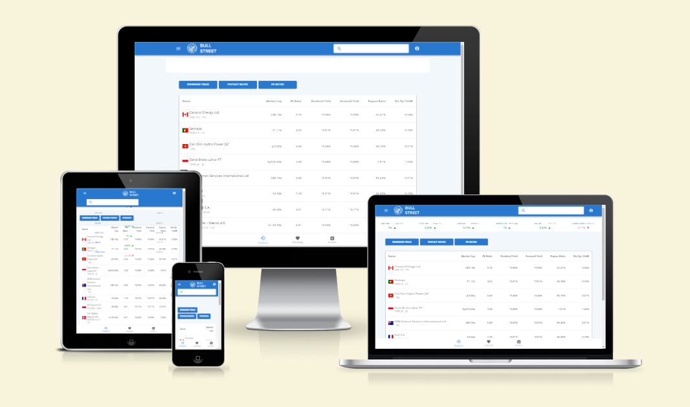

[View Live Website](https://stocks-frontend-d56c65a3a165.herokuapp.com/)

## Use Case

A Swiss-based family office has contracted me to build an investment analysis platform to analyze dividend-paying stocks for their yield-bearing investment portfolio, with a strong focus on European companies. Although there are tools available, one of the biggest challenges they face is building a shortlist of companies they want to understand better.

The platform needs to focus on three areas:

1. **Stock Screener**: Allows filtering based on yield criteria, including yield size, payout ratio, and price-to-earnings ratio.
2. **Individual Stock Pages**: Provides a breakdown of the company's fundamental performance.
3. **Investment Note-Taking Feature**: Enables users to take, edit, and delete notes, which are easily accessible for internal memos.

The project includes a React-based backend, available [here](https://github.com/ouzifeng/CI_PP5_API). This repository is dedicated to the frontend, built using React JS.

## User Experience

### Target Audience

- Investment managers researching a portfolio of stocks
- Investment managers performing fundamental analysis on individual stocks
- Financial auditors performing an investment audit on investment decisions

### User Requirements

- Coverage of all major European exchanges
- Coverage of some key Asian exchanges
- Clean, easy-to-read layout with extensive data points
- Email login
- Google login (nice to have)
- Search for stocks using name or ticker
- Create a shortlist of stocks of interest
- Create, edit, and delete investment notes
- Keep up to date with global index prices
- A stock screener with various filters to narrow down the search for companies

### User Stories

#### Account Registration

1. **New User Registration with Email**
2. **New User Registration with Google**

#### Finding Stocks

3. **Search Stock Database by Company Name**
4. **Filter Stocks by Yield**
5. **Filter Stocks by Dividend Payout Ratio**
6. **Filter Stocks by Price-to-Earnings Ratio**
7. **Build a Shortlist of Stocks**
8. **Compare Stocks with Similar Financial Metrics**

#### Individual Stock Research

9. **View Latest Global Index Prices**
10. **See Stock Price Over Previous 12 Months**
11. **View Key Financial Highlights**
12. **View Basic Stock Information (ticker, industry, listing, company website)**
13. **View Company Description**
14. **Graphical Representation of Revenue, Gross, and Net Income Over 5 Years**
15. **View Key 5-Year CAGR Metrics**
16. **View Analyst Ratings (if available)**
17. **Graphical Display of Dividends Paid Over 5 Years**
18. **View Key Margin Metrics**
19. **View Key Valuation Metrics**
20. **View Key Technical Metrics**
21. **View Splits and Dividend-Related Data**

#### Notes

22. **Take Investment Notes**
23. **Edit Investment Notes**
24. **Delete Investment Notes**

## Site Structure

### Base Layout

- **Location**: `src/layouts/BaseLayout.js`
- **Description**: The foundational layout for all pages, including the header, footer, and navigation menu.

### Pages

- **Location**: `src/pages/`
- **Description**: Main views of the application, representing specific routes and functionalities.
  - `ContactUs.js`: Contact information and form.
  - `DividendScreener.js`: Tool for screening and filtering dividend stocks.
  - `EmailVerified.js`: Confirmation page after email verification.
  - `Following.js`: Page showing stocks the user is following.
  - `ForgotPassword.js`: Password recovery page.
  - `Login.js`: User authentication page.
  - `ResetPassword.js`: Password reset page.
  - `SignUp.js`: New user registration page.
  - `StockDetailPage.js`: Detailed view of individual stocks, including metrics, notes, and historical data.

### Components

- **Location**: `src/components/`
- **Description**: Reusable UI elements and functionalities.
  - **Common Components (`src/components/common/`)**:
    - **Footer.js**: Footer component with site links and information.
    - **Header.jsx**: Header component with logo, navigation, and user options.
    - **MenuDrawer.js**: Sidebar menu for navigation in a collapsible drawer format.
  - **Context (`src/context/`)**:
    - **AuthContext.js**: Manages authentication state, including login and logout methods.
  - **Routes (`src/components/`)**:
    - **ProtectedRoute.js**: Restricts access to routes based on authentication status.
    - **RestrictedRoute.js**: Restricts routes for authenticated users.
  - **Utility Components**:
    - **useDebounce.js**: Custom hook for debouncing values.
    - **MessageAndRedirect.js**: Displays a message and redirects after a period.

### Assets

- **Location**: `src/assets/`
- **Description**: Static files like images and stylesheets.
  - `images/`: Image files.
  - `styles/`: Custom CSS files.

### Utilities

- **Location**: `src/utils/`
- **Description**: Utility functions and helpers.

### Services

- **Location**: `src/services/`
- **Description**: Modules for API calls and backend interactions.

## Development Practices

- **Environment Configuration**
  - **Location**: `.env.local`
  - **Description**: Stores environment variables.

- **Global Styles**
  - **Location**: `App.css`
  - **Description**: Contains global CSS styles.

## Testing

User story testing details can be found in a separate file [here](/TESTME.md).

## Libraries Used

### Dependencies

#### Core Libraries

- **react** (`^18.2.0`)
- **react-dom** (`^18.2.0`)

#### UI Components and Styling

- **@emotion/react** (`^11.11.3`)
- **@emotion/styled** (`^11.11.0`)
- **@fontsource/roboto** (`^5.0.8`)
- **@mui/icons-material** (`^5.15.6`)
- **@mui/lab** (`^5.0.0-alpha.163`)
- **@mui/material** (`^5.15.6`)
- **bootstrap** (`^5.3.2`)
- **react-bootstrap** (`^2.10.0`)

#### Authentication

- **@react-oauth/google** (`^0.12.1`)

#### Data Fetching and Manipulation

- **axios** (`^1.7.2`)
- **json-2-csv** (`^5.0.1`)
- **papaparse** (`^5.4.1`)
- **jwt-decode** (`^4.0.0`)

#### Data Visualization

- **chart.js** (`^4.4.1`)
- **chartjs-adapter-date-fns** (`^3.0.0`)
- **lightweight-charts** (`^4.1.2`)
- **react-chartjs-2** (`^5.2.0`)

#### Utilities

- **lodash** (`^4.17.21`)
- **react-country-flag** (`^3.1.0`)
- **react-helmet** (`^6.1.0`)
- **react-router-dom** (`^6.21.3`)
- **react-scripts** (`5.0.1`)
- **react-toastify** (`^10.0.4`)
- **web-vitals** (`^2.1.4`)

## Styling

The React MUI (Material UI) library was used for the core design.

MUI (Material-UI) is a popular React UI framework that implements Google's Material Design. It provides a comprehensive collection of pre-styled components that are highly customizable and easy to use, which helps in building responsive and visually appealing web applications.

### Why MUI is a Good Choice for React Projects

* Comprehensive Component Library: MUI offers a vast library of components, such as buttons, cards, dialogs, and forms, which are all built with accessibility and responsiveness in mind. This saves a lot of development time as you don't have to build these components from scratch.

* Consistent Design Language: By adhering to Material Design principles, MUI ensures a consistent look and feel across your application. This helps in creating a cohesive user experience.

* Customizability: While MUI components come with default styles, they are highly customizable. You can override styles using various methods like the sx prop, styled function, or by creating custom themes.

* Theming: MUI provides a robust theming mechanism, allowing you to define global design tokens (such as colors, typography, and spacing) that can be applied consistently across your application.

* Accessibility: MUI components follow WAI-ARIA guidelines, ensuring that the interfaces built with MUI are accessible to all users, including those using assistive technologies.

* Community and Documentation: MUI has a large community and extensive documentation, making it easier to find solutions to common problems and get help when needed.

* Integration with Other Libraries: MUI works well with other libraries and tools in the React ecosystem, such as Formik for forms, React Router for navigation, and Redux for state management.

## Font

Open Sans was used as the main font due to its egibility across print, web, and mobile interfaces.

## Colour Scheme

The color scheme of the Bull Street investment platform was designed to follow the principles of Material UI (MUI) to create a visually appealing and user-friendly interface. MUI provides a structured approach to color usage, ensuring consistency and accessibility across the application.

### Primary Colors

Primary Color: The primary color is used predominantly across the platform for elements like buttons, links, and active states. This color is a shade of blue (#1976d2), which is both professional and calming, aligning well with the financial theme of the application.

### Secondary Color

The secondary color is used for highlighting and accentuating elements that need to draw attention, such as secondary buttons and icons. A complementary shade of green (#388e3c) was chosen for its positive connotations, often associated with growth and success.

### Background Colors

Main Background: The main background color is a very light grey (#f5f5f5), providing a neutral and clean canvas that enhances readability and reduces strain on the eyes during extended use.

### Paper Background

Components like cards and modals use a slightly darker shade of grey (#ffffff) to distinguish them from the main background while maintaining a cohesive look.

### Text Colors

Primary Text: The primary text color is a dark grey (#333333), ensuring high readability and contrast against the lighter background colors.

Secondary Text: The secondary text color is a medium grey (#757575), used for less critical information, such as secondary labels and inactive states.

### Button Colors

Primary Button: The primary buttons use the primary color (#1976d2) for their background, with white text (#ffffff) to ensure high contrast and readability.

Secondary Button: The secondary buttons use the secondary color (#388e3c) for their background, also with white text (#ffffff).

### Alerts and Notifications

Success: Success messages use a bright green (#4caf50) to convey positive actions and confirmations.
Error: Error messages use a vivid red (#f44336) to immediately draw attention to critical issues.
Warning: Warning messages use a bold yellow (#ff9800) to highlight cautionary information.
Info: Informational messages use a soft blue (#2196f3) to convey neutral or helpful information.
Accessibility

All colors were chosen not only for their aesthetic appeal but also to ensure accessibility. High contrast ratios were maintained to meet WCAG guidelines, making the platform usable for individuals with visual impairments.

## Wireframes

Although the investment platform is primarily designed to work on desktop as mobile device screens are considered too small to perform proper analysis, the platform still needed to be responsive both on tablets and mobile devices, for analysis on the go.

  
Contact Page - Desktop

  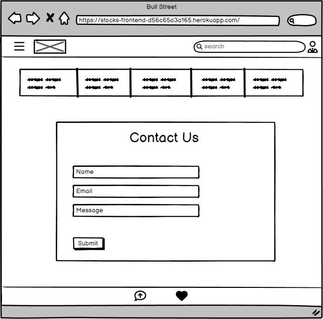

  
Contact Page - Mobile

  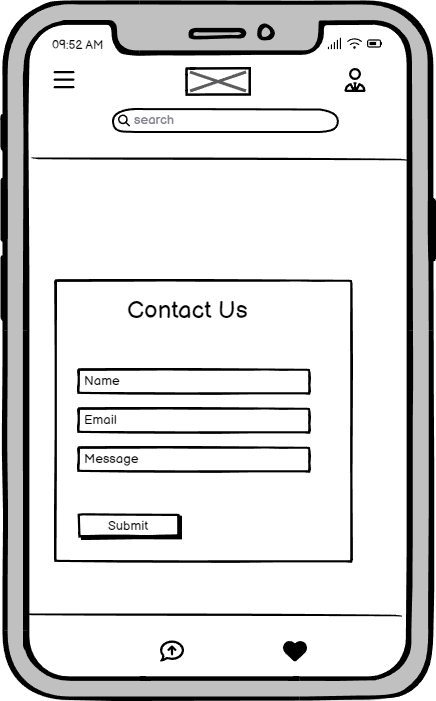

  
Contact Page - Tablet

  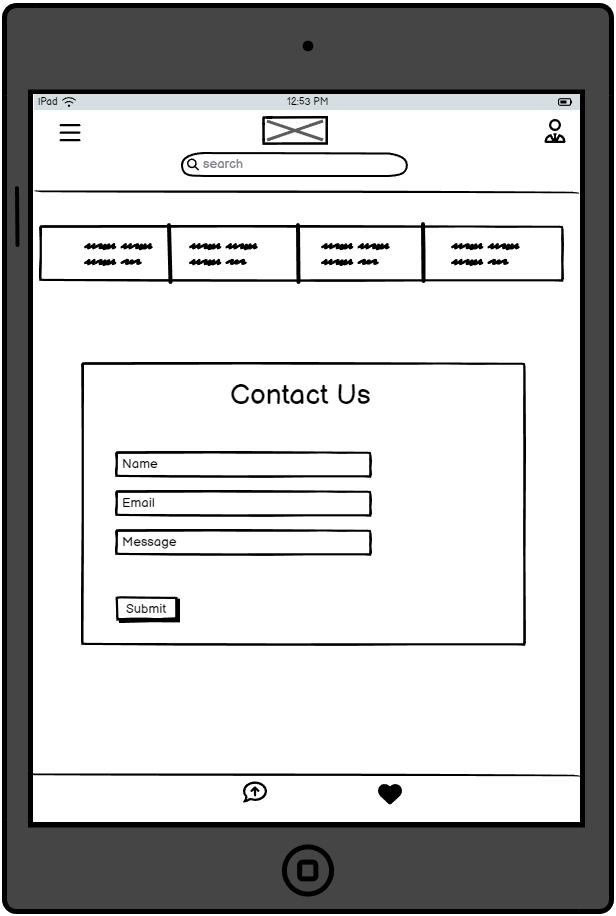

  
Following Page - Desktop

  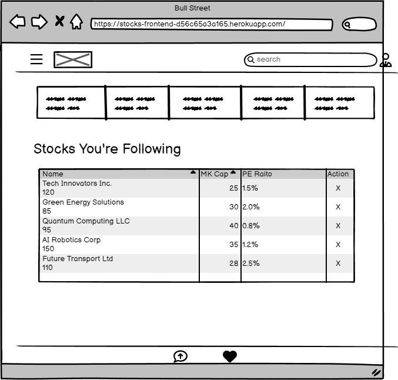

  
Following Page - Mobile

  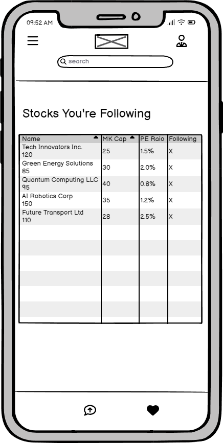

  
Following Page - Tablet

  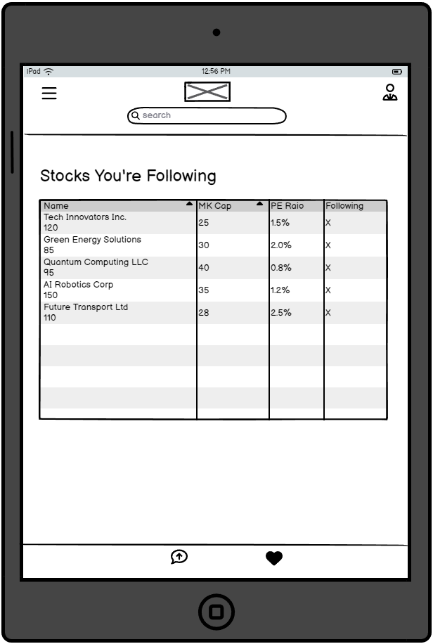

  
Home Page - Desktop

  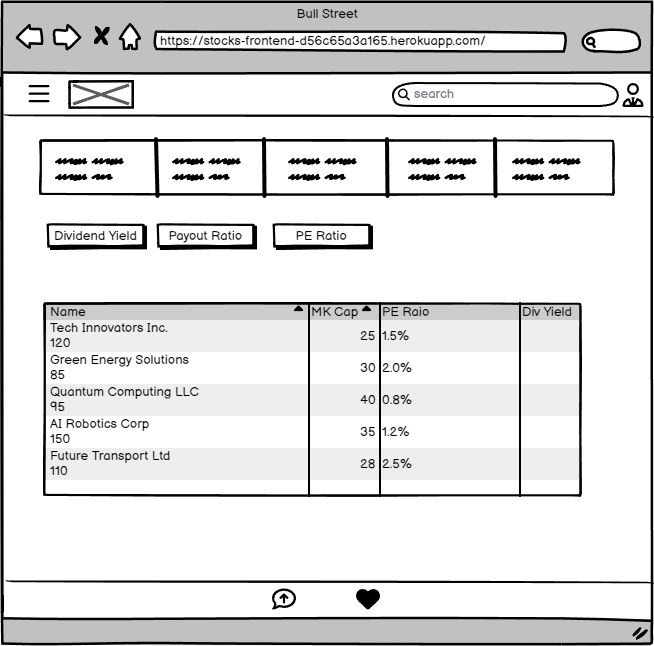

  
Home Page - Mobile

  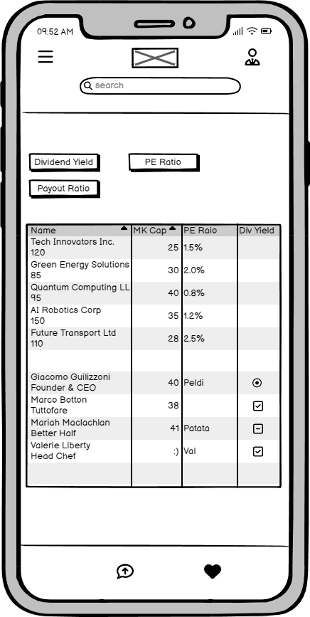

  
Home Page - Tablet

  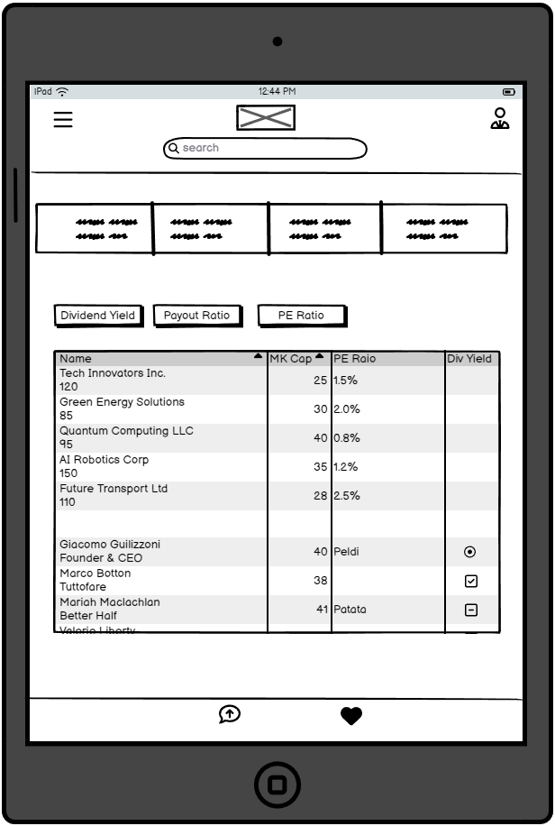

  
Register Page - Desktop

  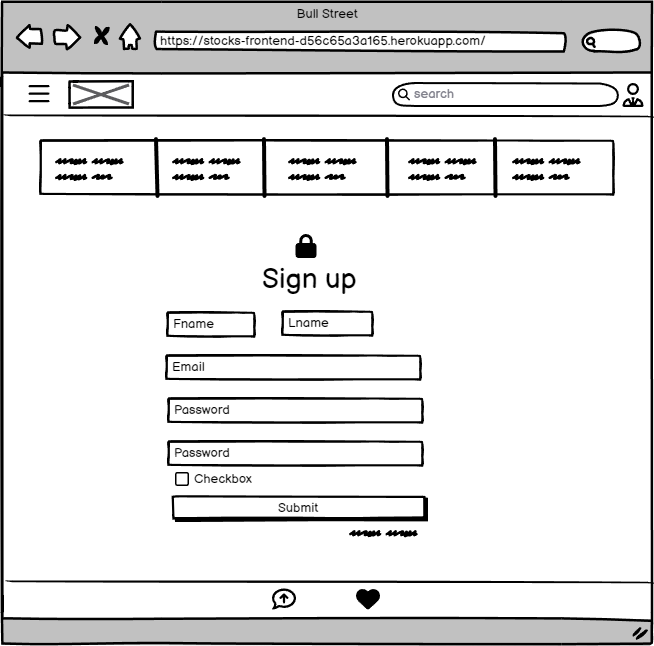

  
Register Page - Mobile

  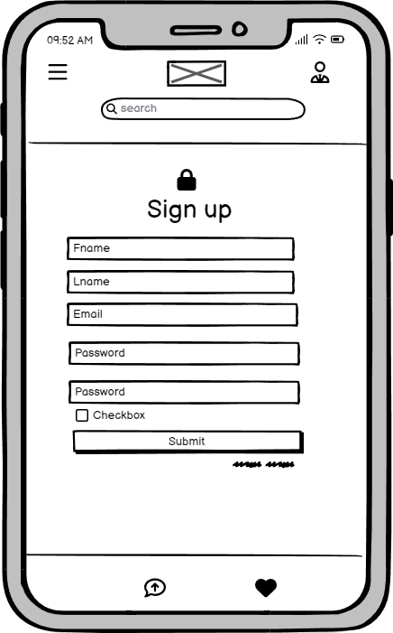

  
Register Page - Tablet

  

  
Sign In Page - Desktop

  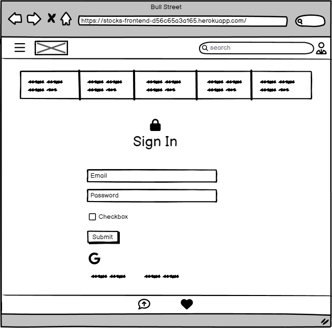

  
Sign In Page - Mobile

  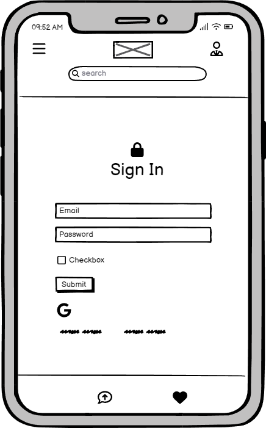

  
Sign In Page - Tablet

  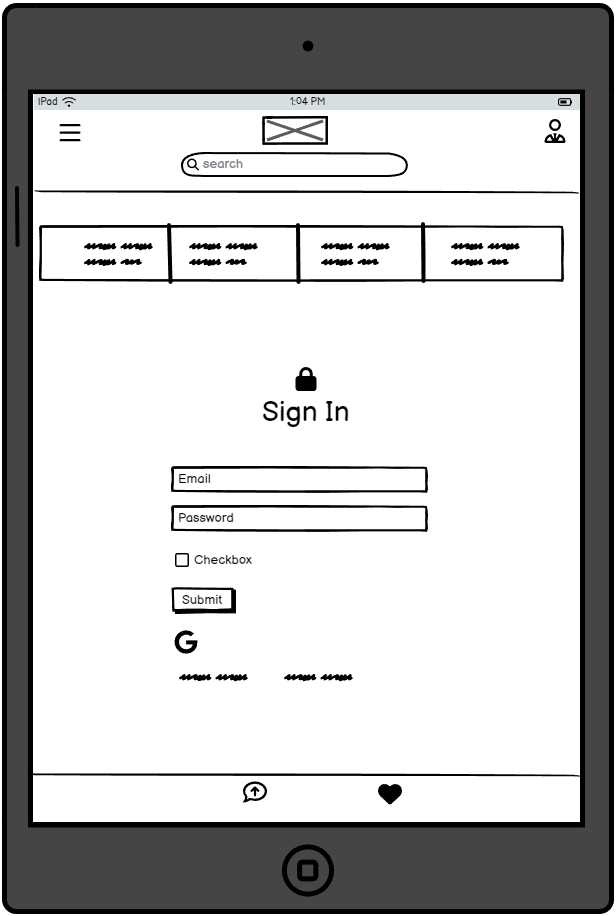

  
Stock Home Page

  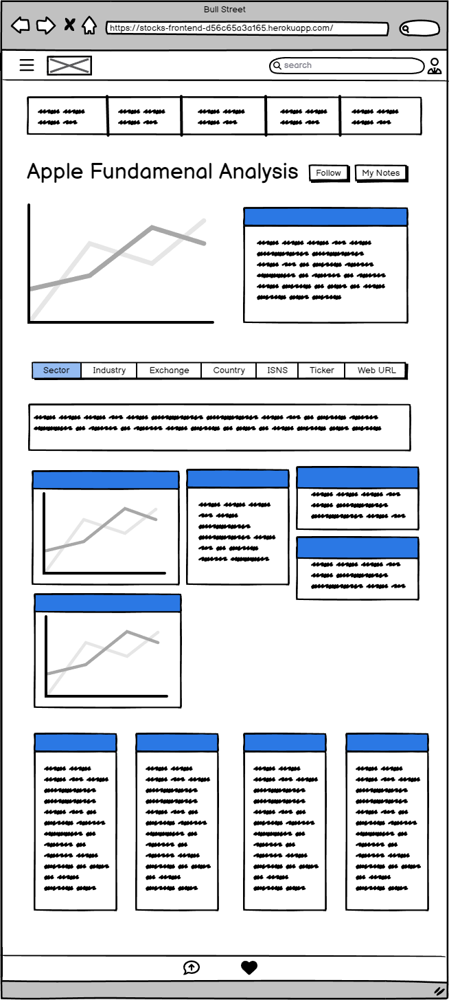

  
Stock Page - Mobile

  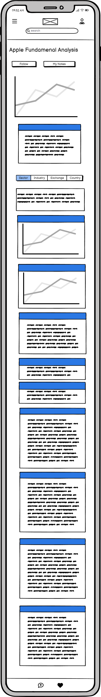

  
Stock Page - Tablet

  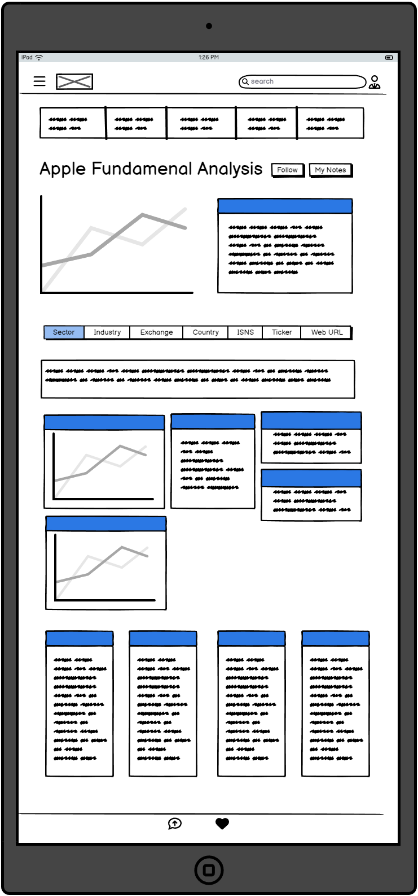

## Features

### Account Registration

* New User Registration with Email
* New User Registration with Google

User stories: 1, 2

### Finding Stocks

* Search Stock Database by Company Name
* Filter Stocks by Yield
* Filter Stocks by Dividend Payout Ratio
* Filter Stocks by Price-to-Earnings Ratio
* Build a Shortlist of Stocks
* Compare Stocks with Similar Financial Metrics

User stories: 3, 4, 5, 6, 7, 8

### Individual Stock Research

* View Latest Global Index Prices
* See Stock Price Over Previous 12 Months
* View Key Financial Highlights
* View Basic Stock Information (ticker, industry, listing, company website)
* View Company Description
* Graphical Representation of Revenue, Gross, and Net Income Over 5 Years
* View Key 5-Year CAGR Metrics
* View Analyst Ratings (if available)
* Graphical Display of Dividends Paid Over 5 Years
* View Key Margin Metrics
* View Key Valuation Metrics
* View Key Technical Metrics
* View Splits and Dividend-Related Data

User stories: 9, 10, 11, 12, 13, 14, 15, 16, 17, 18, 19, 20, 21

### Notes

* Take Investment Notes
* Edit Investment Notes
* Delete Investment Notes

User stories: 22, 23, 24

## Bug Fixes

| **Bug** | **Fix** |
| ------- | ------- |
| Incorrect navigation after Google Sign-In | Modified the Google Sign-In handler to correctly redirect users to the homepage after successful login |
| Alert component not closing on click in the SignIn page | Updated the Alert component logic to ensure it closes properly when the close button is clicked |
| Form validation not triggering on the SignUp page | Added form validation logic to trigger correctly on the SignUp page and display relevant error messages |
| Stock search results not clearing when input is less than 3 characters | Implemented a check to clear stock search results when the input length is less than 3 characters |
| Infinite loading spinner on the Header search bar | Fixed the search bar to correctly stop the loading spinner once results are fetched |
| Pagination issue on the stock list page | Added pagination logic to handle large lists of stocks and improve performance on the stock list page |
| Footer navigation not redirecting correctly on mobile devices | Corrected the Footer navigation logic to ensure proper redirection on mobile devices |
| ReactCountryFlag component not rendering flags in the search results | Updated the search results rendering logic to correctly display country flags using the ReactCountryFlag component |
| Responsive design issues on the Contact and Following pages | Adjusted CSS and layout to ensure the Contact and Following pages render correctly on all devices |
| Missing alt attributes for images causing accessibility issues | Added alt attributes to all images in the project to improve accessibility compliance |
| User context not updating on login/logout actions | Fixed the user context provider to properly update the state on login and logout actions |
| Issue with static assets not loading in production | Added a static.json file to configure serving of static assets correctly in the production environment |
| Error handling for API requests not displaying messages | Implemented error handling to display relevant error messages for API request failures |
| Navigation bar not collapsing on mobile view | Fixed the navigation bar logic to collapse correctly on smaller screens and mobile devices |
| Header component rendering incorrectly on page refresh | Modified the Header component to ensure it renders correctly after a page refresh |

## Deployment Guide

### Step 1: Fork the Repository

1. Go to the GitHub repository: [CI_PP5_React_StockAnalysis](https://github.com/ouzifeng/CI_PP5_React_StockAnalysis.git).
2. Click on the "Fork" button at the top right corner of the repository page.
3. Choose your GitHub account to fork the repository.

### Step 2: Create a Heroku Account

1. If you don't already have a Heroku account, go to [Heroku](https://www.heroku.com/) and sign up for a free account.
2. Log in to your Heroku account.

### Step 3: Create a New Heroku App

1. In the Heroku Dashboard, click on the "New" button.
2. Select "Create new app" from the dropdown menu.
3. Enter a unique name for your app and choose your region.
4. Click on the "Create app" button.

### Step 4: Connect GitHub to Heroku

1. In the Heroku Dashboard, navigate to the "Deploy" tab of your newly created app.
2. In the "Deployment method" section, select "GitHub".
3. Click the "Connect to GitHub" button.
4. If prompted, authorize Heroku to access your GitHub account.
5. In the "Connect to GitHub" section, search for your forked repository by name.
6. Once you find your repository, click the "Connect" button.

### Step 5: Configure Buildpacks

1. In the Heroku Dashboard, navigate to the "Settings" tab of your app.
2. Scroll down to the "Buildpacks" section and click "Add buildpack".
3. Select "nodejs" from the buildpack list and click "Save changes".

### Step 6: Configure Automatic Deploys (Optional)

1. In the "Automatic deploys" section, select the branch you want to deploy (e.g., `main`).
2. Click the "Enable Automatic Deploys" button.

### Step 7: Deploy the Application

1. In the "Manual deploy" section, ensure the correct branch is selected.
2. Click the "Deploy Branch" button.
3. Wait for the deployment process to complete. You can monitor the build process in the activity log.

### Step 8: Configure Environment Variables

1. In the Heroku Dashboard, navigate to the "Settings" tab.
2. Click the "Reveal Config Vars" button.
3. Add the required environment variables for your application. For example:
   - `NODE_ENV`: `production`
   - `REACT_APP_API_URL`: `<your_api_url>`

### Troubleshooting

- If you encounter any issues during the deployment, check the build logs in the Heroku Dashboard under the "Activity" tab.
- Ensure that all environment variables are correctly set.
- Refer to the Heroku documentation for additional troubleshooting tips: [Heroku Dev Center](https://devcenter.heroku.com/).

Congratulations! You have successfully deployed the CI_PP5_React_StockAnalysis project on Heroku.

## Thank You

* To the CI for allowing me to take a leave of absence, this allowed me to come back focused and excited to finish the project
* To my mentor Mo Shami