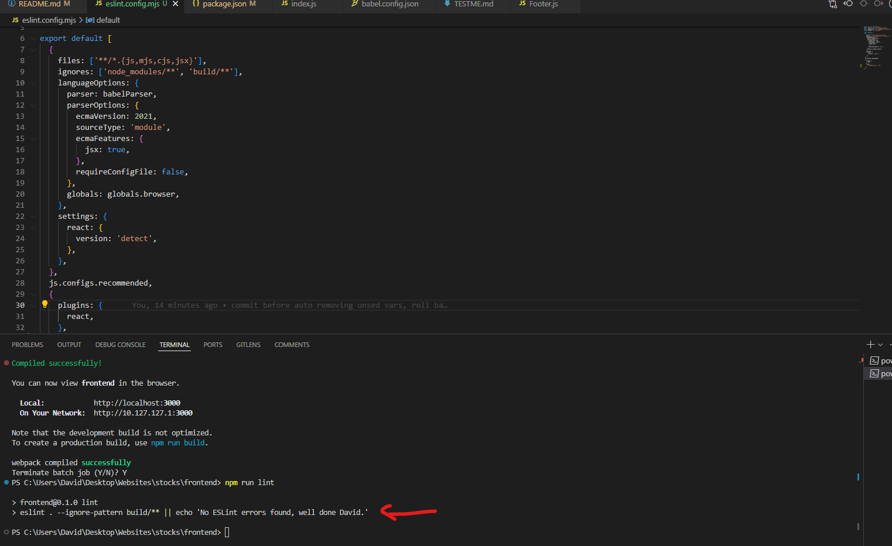

# Manual Testing

## Introduction

This document outlines the manual testing procedures for the Bull Street investment app. Each section corresponds to a specific user story, detailing the steps required to verify the functionality and expected outcomes.

---

## Table of Contents

1. [Account Registration](#account-registration)
2. [Finding Stocks](#finding-stocks)
3. [Individual Stock Research](#individual-stock-research)
4. [Notes](#notes)
5. [ESLint Results](#eslint-results)

---

## Account Registration

### As a new user, I can register an account with my email

| Step | Action | Expected Outcome |
|------|--------|------------------|
| 1 | Navigate to the registration page | Registration page is displayed |
| 2 | Fill out the registration form with a valid email address, password, and any other required fields | Form is filled out correctly |
| 3 | Click the "Register" button | Confirmation email is sent |
| 4 | Confirm the email by clicking the link in the confirmation email | Account is confirmed and user is redirected to the login page |

[![Account Registration with Email Video]](https://www.loom.com/share/16d45ca6b6484fe8ad7187c0da06d0dd)

### As a new user, I can register an account with my Google

| Step | Action | Expected Outcome |
|------|--------|------------------|
| 1 | Navigate to the registration page | Registration page is displayed |
| 2 | Click the "Register with Google" button | Google login popup is displayed |
| 3 | Select a Google account to use for registration | User is logged in using Google account and redirected to the dashboard |

[![Account Registration with Google Video]](https://www.loom.com/share/c52d5a5cb1fb4c0c877f06aa252e8acb)

---

## Finding Stocks

### As a user, I want to be able to search the stock database for stocks based on the company name

| Step | Action | Expected Outcome |
|------|--------|------------------|
| 1 | Navigate to the search page | Search page is displayed |
| 2 | Enter a company name into the search bar | Company name is entered |
| 3 | Click the "Search" button | Relevant stocks are displayed based on the entered company name |

[![Search Stocks by Company Name Video]](https://www.loom.com/share/e6c4ef2427854b0cb5d962b3edf461bf)

### As a user, I want to filter stocks out of the database based on their yield

| Step | Action | Expected Outcome |
|------|--------|------------------|
| 1 | Navigate to the filter page | Filter page is displayed |
| 2 | Select a yield range from the filter options | Yield range is selected |
| 3 | Click the "Apply Filter" button | Stocks matching the selected yield range are displayed |

[![Filter Stocks by Yield Video]](https://www.loom.com/share/98b14cd89c764a7386c0634b63fcb035)

### As a user, I want to filter out stocks based on their dividend payout ratio

| Step | Action | Expected Outcome |
|------|--------|------------------|
| 1 | Navigate to the filter page | Filter page is displayed |
| 2 | Select a dividend payout ratio range from the filter options | Dividend payout ratio range is selected |
| 3 | Click the "Apply Filter" button | Stocks matching the selected dividend payout ratio range are displayed |

[![Filter Stocks by Dividend Payout Ratio Video]](https://www.loom.com/share/9f7f65160c9547b68889eecfc6b6e715)

### As a user, I want to be able to filter stocks based on their price to earnings ratio

| Step | Action | Expected Outcome |
|------|--------|------------------|
| 1 | Navigate to the filter page | Filter page is displayed |
| 2 | Select a price to earnings ratio range from the filter options | Price to earnings ratio range is selected |
| 3 | Click the "Apply Filter" button | Stocks matching the selected price to earnings ratio range are displayed |

[![Filter Stocks by Price to Earnings Ratio Video]](https://www.loom.com/share/bb42a69675a04ef3910c5ec2679bbc10)

### As a user, I want to be able to build a shortlist of stocks I am interested in

| Step | Action | Expected Outcome |
|------|--------|------------------|
| 1 | Search or filter for stocks of interest | Stocks are displayed |
| 2 | Click the "Add to Shortlist" button for each desired stock | Selected stocks are added to the shortlist |
| 3 | Navigate to the shortlist page | Shortlist page is displayed |
| 4 | Verify that the selected stocks are listed in the shortlist | Selected stocks are present in the shortlist |

[![Build Shortlist Video]](https://www.loom.com/share/7d3ce2110ef9460eaac31c37b370b44f?sid=6fe79a77-de1b-40fd-89eb-05b518267869)

### As a user, I want to be able to compare stocks with similar financial metrics in a table, with top-level investment information available

| Step | Action | Expected Outcome |
|------|--------|------------------|
| 1 | Navigate to the compare stocks page | Compare stocks page is displayed |
| 2 | Select multiple stocks to compare | Selected stocks are displayed in a comparison table |
| 3 | Verify that the comparison table displays financial metrics and top-level investment information for the selected stocks | Financial metrics and investment information are correctly displayed |

[![Compare Stocks Video]](https://www.loom.com/share/c762c4e4a341418787b9d3dbf34fbc1a)

---

## Individual Stock Research

### As a user, I want to be able to see the latest global index prices

| Step | Action | Expected Outcome |
|------|--------|------------------|
| 1 | Navigate to the dashboard or relevant page | Page is displayed |
| 2 | Verify that the latest global index prices are displayed prominently | Global index prices are displayed |

[![Global Index Prices Video]](https://www.loom.com/share/aea568fb36c240aa9caff7df4f917607)

### As a user, I want to be able to see the stock price over the previous 12 months

| Step | Action | Expected Outcome |
|------|--------|------------------|
| 1 | Navigate to the stock detail page | Stock detail page is displayed |
| 2 | Verify that the stock price chart displays data for the previous 12 months | Stock price chart is displayed correctly |

[![Stock Price Over 12 Months Video]](https://www.loom.com/share/121f23bd8d354dbfa71ff5e56ba3c6e7)

### As a user, I want to see key financial highlights

| Step | Action | Expected Outcome |
|------|--------|------------------|
| 1 | Navigate to the stock detail page | Stock detail page is displayed |
| 2 | Verify that key financial highlights are displayed | Key financial highlights are displayed |

[![Key Financial Highlights Video]](https://www.loom.com/share/6c4c72b39c544a03b499bd282f156a93)

### As a user, I want to view basic stock information like its ticker, industry, where it is listed, and a hyperlink to the company website

| Step | Action | Expected Outcome |
|------|--------|------------------|
| 1 | Navigate to the stock detail page | Stock detail page is displayed |
| 2 | Verify that basic stock information like its ticker, industry, listing, and hyperlink to the company website are displayed | Basic stock information is displayed correctly |

[![Basic Stock Information Video]](https://www.loom.com/share/79553eedcb4f496c99cc7c7eb29775d3)

### As a user, I want a description of the company to help understand where it operates

| Step | Action | Expected Outcome |
|------|--------|------------------|
| 1 | Navigate to the stock detail page | Stock detail page is displayed |
| 2 | Verify that a description of the company is displayed | Company description is displayed correctly |

[![Company Description Video]](https://www.loom.com/share/14b5d78be5ca4d63b31be5fb9d3e3eb0)

### As a user, I want to see a graphical representation of its revenue, gross, and net income over the past 5 years

| Step | Action | Expected Outcome |
|------|--------|------------------|
| 1 | Navigate to the stock detail page | Stock detail page is displayed |
| 2 | Verify that a graphical representation of its revenue, gross, and net income over the past 5 years is displayed | Graphical representation is displayed correctly |

[![Graphical Representation of Financials Video]](https://www.loom.com/share/9f70ca9af03a41ee99c7477165ec1a66)

### As a user, I want to see key 5-year CAGR metrics, if available

| Step | Action | Expected Outcome |
|------|--------|------------------|
| 1 | Navigate to the stock detail page | Stock detail page is displayed |
| 2 | Verify that key 5-year CAGR metrics are displayed if available | 5-year CAGR metrics are displayed correctly if available |

[![5-Year CAGR Metrics Video]](https://www.loom.com/share/04cdbb99c33b4baf80de8375f46bd738)

### If available, as a user I want to see analyst ratings as an average and the past month. It is understood that not all stocks are covered by analysts and that this information is not always available

| Step | Action | Expected Outcome |
|------|--------|------------------|
| 1 | Navigate to the stock detail page | Stock detail page is displayed |
| 2 | Verify that analyst ratings are displayed if available | Analyst ratings are displayed correctly if available |

[![Analyst Ratings Video]](https://www.loom.com/share/1975da9435404137be5af0f9eb815300)

### If the company has paid a dividend over the past 5 years, as a user I want to see this displayed graphically

| Step | Action | Expected Outcome |
|------|--------|------------------|
| 1 | Navigate to the stock detail page | Stock detail page is displayed |
| 2 | Verify that dividend payments over the past 5 years are displayed graphically | Dividend payments are displayed correctly |

[![Dividend Payments Video]](https://www.loom.com/share/c3b9e6cc2c7440b9ac4f2cb6d7c7d096)

### As a user, I want to see key margin metrics of the business

| Step | Action | Expected Outcome |
|------|--------|------------------|
| 1 | Navigate to the stock detail page | Stock detail page is displayed |
| 2 | Verify that key margin metrics of the business are displayed | Key margin metrics are displayed correctly |

[![Margin Metrics Video]](https://www.loom.com/share/406e85be1ae74d068fb86ba723966af9)

### As a user, I want to see key valuation metrics of the business

| Step | Action | Expected Outcome |
|------|--------|------------------|
| 1 | Navigate to the stock detail page | Stock detail page is displayed |
| 2 | Verify that key valuation metrics of the business are displayed | Key valuation metrics are displayed correctly |

[![Valuation Metrics Video]](https://www.loom.com/share/6c14fe5a790647378c47d17243016aff)

### As a user, I want to see key technical metrics of the business

| Step | Action | Expected Outcome |
|------|--------|------------------|
| 1 | Navigate to the stock detail page | Stock detail page is displayed |
| 2 | Verify that key technical metrics of the business are displayed | Key technical metrics are displayed correctly |

[![Technical Metrics Video]](https://www.loom.com/share/dcd8d1a101644e4e803d4dde80667e05)

### As a user, I want to see splits and dividend-related data

| Step | Action | Expected Outcome |
|------|--------|------------------|
| 1 | Navigate to the stock detail page | Stock detail page is displayed |
| 2 | Verify that splits and dividend-related data are displayed | Splits and dividend-related data are displayed correctly |

[![Splits and Dividend Data Video]](https://www.loom.com/share/24d8c2d409a74d378a7aa0f672073c0a)

---

## Notes

### As a logged-in user, I want to be able to take investment notes as I go about my research

| Step | Action | Expected Outcome |
|------|--------|------------------|
| 1 | Navigate to the notes page | Notes page is displayed |
| 2 | Enter a new note in the input field | Note is entered correctly |
| 3 | Click the "Save" button | Note is saved and displayed in the list of notes |

[![Take Investment Notes Video]](https://www.loom.com/share/3bebf62e586d4280be502cf7cd9e3ee0)

### As a logged-in user, I want to be able to edit investment notes as I go about my research

| Step | Action | Expected Outcome |
|------|--------|------------------|
| 1 | Navigate to the notes page | Notes page is displayed |
| 2 | Click the "Edit" button next to a note | Note is editable |
| 3 | Modify the note and click "Save" | Note is updated and displayed in the list of notes |

[![Edit Investment Notes Video]](https://www.loom.com/share/a3aaba2a33cd48358453c9435d793bd3)

### As a logged-in user, I want to be able to delete investment notes as I go about my research

| Step | Action | Expected Outcome |
|------|--------|------------------|
| 1 | Navigate to the notes page | Notes page is displayed |
| 2 | Click the "Delete" button next to a note | Note is deleted from the list of notes |

[![Delete Investment Notes Video]](https://www.loom.com/share/dcf4cbe2ba79445d9dc10f0fa1449221)

---

## ESLint Results

The Bull Street investment app uses ESLint for maintaining code quality and consistency. ESLint helps identify and fix problems in the JavaScript codebase.

### ESLint Configuration

The ESLint setup includes the following configurations and plugins:

- **ESLint**: The core linter engine.
- **@eslint/js**: The recommended configuration for ESLint.
- **eslint-plugin-react**: A plugin to support React-specific linting rules.
- **@babel/eslint-parser**: A parser that allows ESLint to lint all valid Babel code.
- **globals**: A library for defining global variables that are predefined.

### ESLint Plugins and Settings

- **Parser Options**:
  - **ecmaVersion**: 2021
  - **sourceType**: module
  - **ecmaFeatures**: 
    - **jsx**: true
  - **requireConfigFile**: false

- **Globals**: The `globals.browser` settings are used to define global variables for browser environments.

- **React Version Detection**: The React version is automatically detected using `eslint-plugin-react` settings.

### ESLint Results Image

The following image shows the ESLint results after running the linter on the codebase:

No errors were found.
---

## HTML Validation

Each page was run through the W3C Markup Validation tool. The warnings about trailing slashes are due to the structure of the index.html file generated by Create React App and can be ignored

* 
* 
* 
* 
* 
* 

## CSS Validation

Each page was run through the W3C CSS validation service, each page passed with a "Congratulations! No Error Found."

* 
* 
* 
* 
* 
* 

## Device Testing & Browser Compatibility

Using the Chrome extension "Mobile simulator, responsive testing tool" the platform has been tested on:

* Samsung Galaxy S20
* Galaxy Z flip
* Apple iPhone 5
* Apple iPhone 11
* Apple iPhone 13 pro
* iPad Mini
* iPad Pro 11
* Microsoft Surface Duo
* Galaxy S7 Tab
* Macbook Air

and the following browsers

* Chrome
* Firefox
* Safari
* Bing
